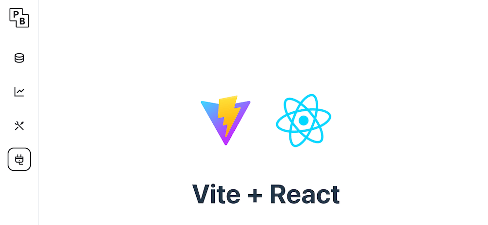

# Pocketbase UI-Pluggable



This is a fork of [PocketBase](https://github.com/pocketbase/pocketbase). The original project can be found at https://github.com/pocketbase/pocketbase.

## Table of Contents

- [UI Plugin Command](#ui-plugin-command)
  - [Installation](#installation)
  - [Usage](#usage)
- [Using the Plugin](#using-the-plugin)
- [Local Development Testing](#local-development-testing)
- [Plugin Structure](#plugin-structure)
- [How it works](#how-it-works)
- [Example](#example-project)

# UI Plugin Command

The `uiplugin` package adds a new `ui-plugin` command to PocketBase that allows you to easily create new UI plugins with a basic structure.

## Installation

This fork is available as a Go module with the package name `github.com/sospartan/pocketbase`.   
 After install with `go get` command, add the `plug` cmd to your main.go file:

```go

// register the plug command
uiplugin.MustRegister(app, app.RootCmd, uiplugin.Config{
	Dir: "ui-plugins", // optional: defaults to "ui-plugins"
})
```

## Usage

Once registered, you can use the `plug` command to create new UI plugins:

```bash
# Create a new UI plugin named "my-plugin", or run `go run ./ plug my-plugin` with source code
pb plug my-plugin

# This will create the following structure:
# ui-plugins/my_plugin/
# ├── plugin.go      # Plugin registration file
# └── dist/          # Static files directory
#     └── index.html # Default HTML file
```


## Using the Plugin

To use the created plugin:

1. **Import the plugin** in your main.go file:
   ```go
   import _ "your-project/ui-plugins/my_plugin"
   ```

2. **Build your frontend assets** and place them in the `dist/` directory

3. **Restart your PocketBase application**

4. **Access your plugin** through the PocketBase admin UI sidebar.

## Local Development Testing

For local development and testing of UI plugins, you can set up a development environment with hot reloading. This involves two steps:

### Step 1: Configure Plugin for Debug Mode

In your plugin's `plugin.go` file, set the `IgnoreRoute` flag based on debug mode:

```go

func init() {
    isDebug := strings.Contains(os.Args[0], "__debug_bin")

    apis.RegisterUIPlugin(apis.UiPlugin{
        Name:        "graph",
        Base:        "graph",
        Icon:        "ri-plug-line",
        FS:          PluginDirFS,
        IgnoreRoute: isDebug,
    })
}
```

### Step 2: Set Up Reverse Proxy in Main Application

In your PocketBase main application, add a reverse proxy to forward requests to your local development server:

```go


func main() {
    app := pocketbase.New()
    
    isDebug := strings.Contains(os.Args[0], "__debug_bin")
    
    app.OnServe().BindFunc(func(se *core.ServeEvent) error {

        // just navigate to http://127.0.0.1:8090/_/#/ui-plugins/graph/ which will use this proxy to access the graph ui local dev server
        if isDebug {
            target, err := url.Parse("http://localhost:3000")
            if err != nil {
                log.Fatal(err)
            }
            proxy := httputil.NewSingleHostReverseProxy(target)
            se.Router.GET("/ui-plugins/graph/{path...}", func(c *core.RequestEvent) error {
                fmt.Println("proxy", c.Request.URL.Path)
                proxy.ServeHTTP(c.Response, c.Request)
                return nil
            })
        }
        return se.Next()
    })
    
    if err := app.Start(); err != nil {
        log.Fatal(err)
    }
}
```

This setup allows you to:
- Run your frontend development server on `localhost:3000`
- Access your plugin through PocketBase at `http://127.0.0.1:8090/_/#/ui-plugins/graph/`
- Have hot reloading for your frontend development if using tools like vite.

## Plugin Structure

Each UI plugin consists of:

- **plugin.go**: Go file that registers the plugin with PocketBase
- **dist/**: Directory containing static frontend assets
  - **index.html**: Main HTML file for the plugin

The plugin will be accessible in the PocketBase admin UI sidebar with the specified icon and name. 

## How it works   

The implementation is based on the changes in commit [f0fb4d4](https://github.com/pocketbase/pocketbase/commit/f0fb4d463d214145ff9d3daa8c584c93a5a7f700), which adds the core UI plugin functionality to PocketBase.

## Example Project

For a complete working example, check out the demo project: [pb-pluggable-demo](https://github.com/sospartan/pb-plugable-demo)
